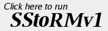
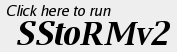

    
SStoRM is a free open source computer program that can simulate Solar Particle Events (SPEs). It is written entirely in Java and can be run online using Java Web Start. It is cross platform and can be run on any computer with JAVA installed. Feel free to play around with it. 
    
      
    

      
       
       
    

    
SStoRM lets you simulate an SPE with a user specified energy spectrum and time evolution. It then let you see how much radiation an astronaut would be exposed to in outer space during that event. It then lets you run a simulation of an astronaut on the moon during the event.

 <h1>Why Three Versions?</h1>

The three version of the program each let you define an SPE differently. SStoRMv1 lets you simulate one SPE at a time. SStoRMv2 lets you simulate two different events happening simultaneously. SStoRMv3 lets you simulate one event that includes a separate Gaussian shock enhanced peak. 

      
