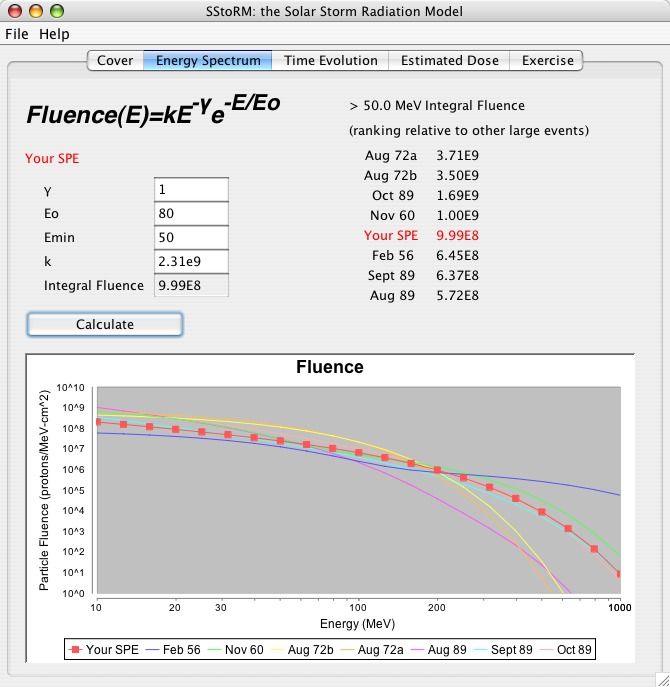
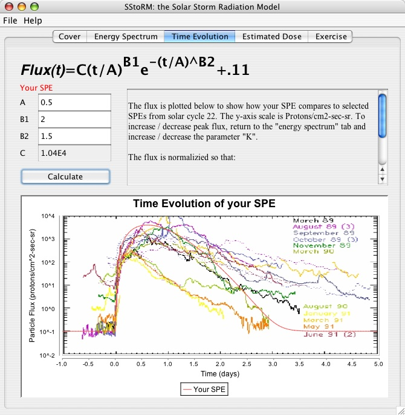
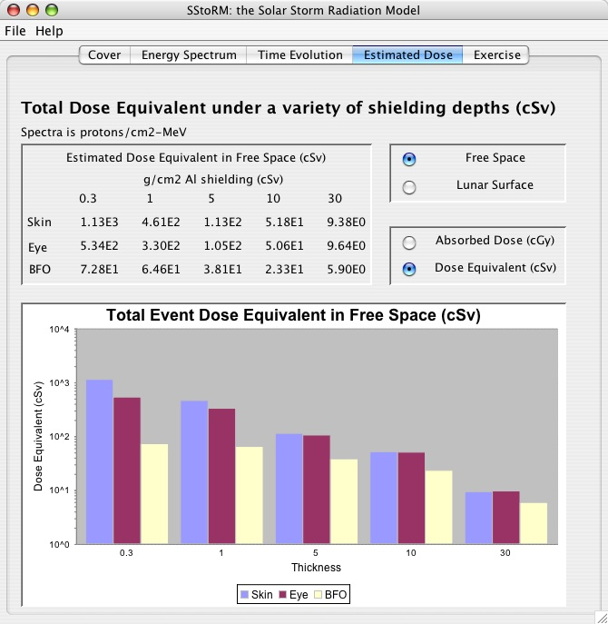
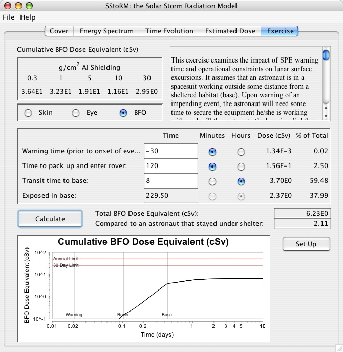
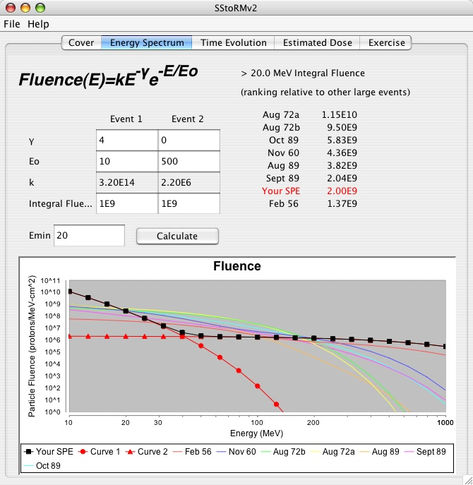
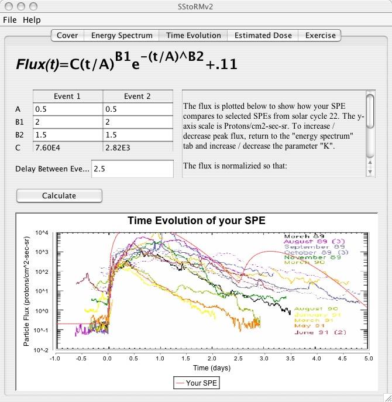
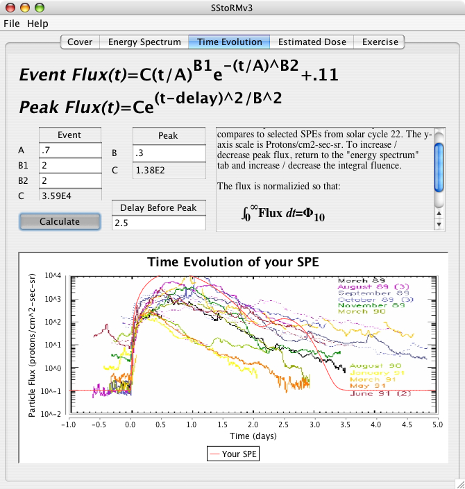
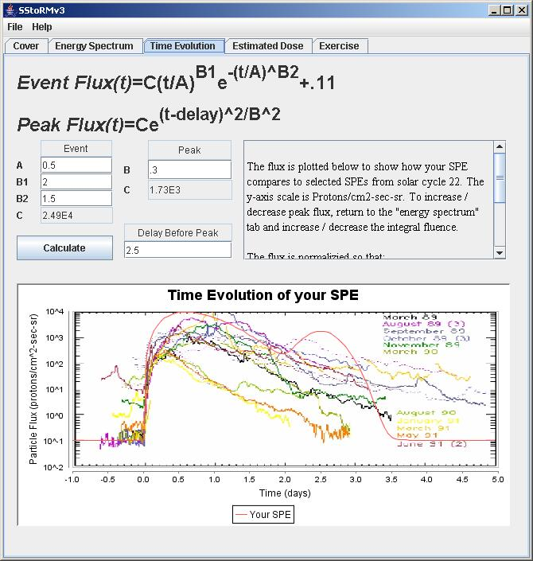
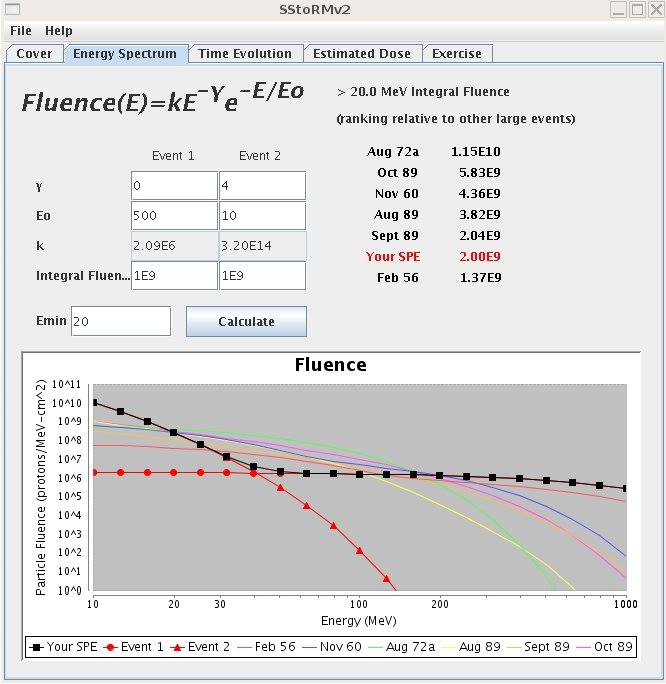

<h1>Screenshots of SStoRM v1</h1>

 

Selecting the fluence of an event.  

 

Selecting the time evolution of the event.  

 

Viewing the "Estiamted Dose" tab.  

 

Viewing the "Exercise Tab".  

<h1>Screenshots of SStoRM v2</h1>

 
Selecting the fluence of both events.  

 
Selecting the time evolution of both events.  

<h1>Screenshots of SStoRM v3</h1>

 
Selecting the time evolution of the shock enhanced peak.  

<h1>SStoRM on other operating systems</h1>
 
SStoRM running on Windows  

 
SStoRM running on Ubuntu Linux 

